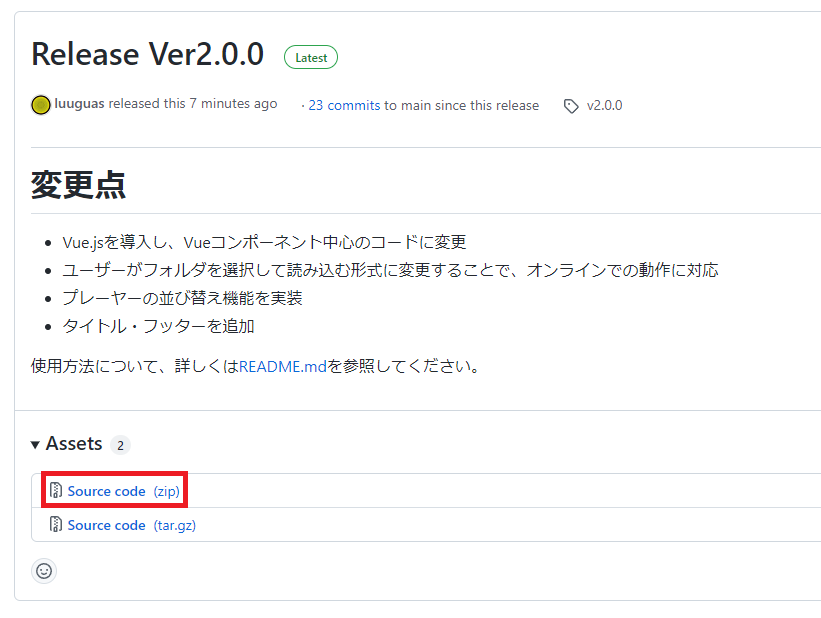

README.md - ***Ver2.0.0***

# Koukou_Acoustic - 演劇用音響機材
Web Application of Acoustic Equipment for Play

演劇に使える音響用のWebアプリケーション

## 注意
このアプリはPC版ChromeとMicrosoft Edgeのみに対応しています。他のブラウザはサポート対象外です。

# 起動
[https://luuguas.github.io/Koukou_Acoustic/](https://luuguas.github.io/Koukou_Acoustic/) から起動できます。
オフラインで使用したい場合は、下記「オフラインで使用する」を参照してください。

# 使い方
## 共通操作
### フォルダを開く
BGM・SE各々について、[フォルダを開く...]ボタンを押してフォルダを選択すると、選択したフォルダの直下にある音声ファイルを読み込みます。

[前回のフォルダを開く]ボタンを押すと、前回開いたフォルダを再び読み込むことが出来ます。 [(一括)前回のフォルダを開く]ボタンでは、BGM・SEの前回開いたフォルダを一括で再読み込みします。

### プレーヤーの並び替え
音声ファイルを読み込むと、以下のようにプレーヤーが表示されます。プレーヤー右側の三本線をドラッグすることで、プレーヤーを並び替えることが出来ます。

プレーヤーの並び順はブラウザに保存され、再びフォルダを開いた際に自動的に前回の並び順に整列されます。並び順の履歴を削除したい場合は、[並び替え履歴を削除する]ボタンを押してください。

## BGM
プレーヤー左側の再生ボタンを押すと再生します。シークバーをドラッグすると再生時間を変更できます。

既にプレーヤーを再生している途中で、そのプレーヤーを一時停止したり、他のプレーヤーの再生ボタンを押したりした時は、現在再生中のプレーヤーの音量がフェードアウトして(徐々に小さくなって)から切り替わります。

#### 再生中

↓

#### フェードアウト中

再生中のプレーヤーの音楽が終了間近になった時も、自動でフェードアウトします。 フェードアウト中は、再生ボタン及びシークバーは操作できません。フェードアウトにかかる時間は、[一時停時のフェードアウト]から設定できます。

## SE(効果音)
クラッカーのボタンを押すと効果音が再生されます。同時に5回まで再生できます。

効果音を途中で止めたいときは停止ボタンをクリックしてください。停止ボタンは再生開始の早い順に並んでいます。

# オフラインで使用する
[Releases](https://github.com/luuguas/Koukou_Acoustic/releases/tag/v2.0.0)ページに移動し、Assetsを開いて [Source code (zip)] をクリックすると、圧縮ファイルがダウンロードされますので、解凍してください。 直接ダウンロードする場合は[こちら](https://github.com/luuguas/Koukou_Acoustic/archive/refs/tags/v2.0.0.zip)をクリック。

解凍したら、フォルダ直下の index.html をブラウザで開いてください。

